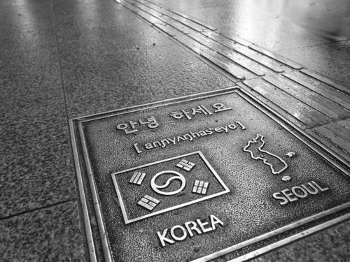

# korean.language.github.io
<!DOCTYPE html>
<html lang="eng,ukr,kor" >

<head>
  <title>Korean language</title>
  <link rel="stylesheet" type="text/css" href="style.css">
</head>

<body>
 
  <nav class="top-menu">
         
         <ul class="menu-main">
           <li><a href="alphabet/alphabet.html">Алфавіт(한길)</a></li>
            <li><a href="start/start.html">Початкові фрази(초기 문구)</a></li>
            <li><a href="number/number.html">Цифри(피규어)</a></li>
            <li><a href="word/word.html">Займенники(대명사)</a></li>
            <li><a href="diction/diction.html">Словник(사전)</a></li>
            <li><a href="photo/photo.html">Фото (사진)</a></li>
         </ul>
      </nav>

  

    
       <h2>안녕하세요! 함께 한국어를 배워요!</h2>
        

  

       <h2>Цікаві факти про Південну Корею від української емігрантки, що мешкає у цій країні.</h2>
     
1. Корея – дуже безпечна країна. Дівчина може не боятися пройтися вночі по спальному району поодинці.

     
2. Випадки страшного злочину, на зразок вбивства, зараховуються до безпрецедентних і тижнями висвітлюються в місцевих новинах.

     
3. Найкращий час для відвідування Кореї – весна, коли розквітають вишні, і осінь, коли жовтіє листя на деревах. Взимку дуже холодно і вітряно, влітку неймовірно спекотно, волого і дощить.

     
4. Територія країни дуже маленька, тому цивілізація проникла у всі її куточки. У Кореї неможливо заблукати, і зовсім глухих сіл тут немає.

     
5. Найпопулярніший вид спорту в Кореї – бейсбол. У нього грають усі, від малого до великого, бейсбольна біта є практично у кожного. На бейсбольних матчах, особливо великих – завжди аншлаг.

    

     
У Сеулі є багато видів культурних заходів. Традиційна, сучасна та класична музика, танці, театральні вистави і багато чого іншого тут можуть запропонувати вам. По всьому місті розсіяно багато малих театрів, які часто є експериментальними.

     
     
У місті діє метрополітен, за обсягами пасажироперевезень займає одне з перших місць в Азії. Дев'ять ліній метро мають номери від 1 до 9

     
В Сеулі розташовуються найпрестижніші університети країни, включаючи Сеульський Національний Університет(서울대학교), Національний Університет Кореї(한국 대학교), і Університет Йонсе(연세대 학교).

     
      <iframe width="560" height="315" src="https://www.youtube.com/embed/ZVcJVmyjhyw" frameborder="0" allow="accelerometer; autoplay; clipboard-write; encrypted-media; gyroscope; picture-in-picture" allowfullscreen></iframe>
      

     
6. На другому місці за популярністю – гольф. У нього грають чоловіки середнього віку. А досягнувши похилого віку, всі корейці йдуть у гори.

     
7. Ходити по горах – це таке улюблена розвага для корейців. Вони можуть встати о 8 ранку після дикої пиятики і все одно полізти на гору.

     
8. 90% корейців короткозорі й змушені носити окуляри або контактні лінзи. Окуляри надягають вже з самого дитинства, що мимоволі створює враження, ніби вони народжуються вже з поганим зором.

     
9. Абсолютно всі корейці користуються Internet Explorer. Про інші браузери вони й не підозрюють і більше того, багато хто навіть не знає, що таке браузер. Корейські сайти, відповідно, робляться тільки під Explorer, в будь-якому іншому браузері жоден корейський сайт не буде працювати коректно.

     
10. Багато корейців, щоб відкрити гугл, спершу відкривають naver.com (це корейська пошукова і не тільки система), вбивають у пошук «гугл» на корейському і потім клацають на сервері.

  

<marquee loop="infinite" height=40 bgcolor="#BC8F8F" scrollamount="6">
Я бажаю тобі успіху у вивченні корейської мови та культури!   한국어와 문화를 배우는 데 성공을 기원합니다! </marquee>

</body>
</html>
